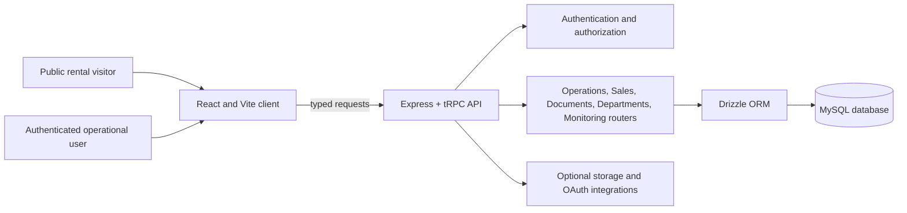

# BOB Cranes Operations Portal

> A full-stack operations workspace for crane rental, booking control, crew readiness, lifting-gear compliance, documentation, dispatch coordination, and rental-enquiry management.

**Live site:** [bob-cranes-portal.vercel.app](https://bob-cranes-portal.vercel.app)

**Repository:** [docs-bit/bob-cranes-operations-portal](https://github.com/docs-bit/bob-cranes-operations-portal)

**Primary stack:** React 19, TypeScript, Vite, Express, tRPC, Drizzle ORM, and MySQL.

---

## Contents

| Section | Purpose |
|---|---|
| [What the portal does](#what-the-portal-does) | Business workflows and operational outcomes. |
| [Architecture](#architecture) | Client, API, persistence, and deployment design. |
| [Portal walkthrough](#portal-walkthrough) | Public, sign-in, and Operations Cockpit screenshots. |
| [Requirements and configuration](#requirements-and-configuration) | Local prerequisites and environment variables. |
| [Local development](#local-development) | Install, migrate, seed, and run instructions. |
| [Testing and quality checks](#testing-and-quality-checks) | Type checking, unit tests, E2E tests, and production build. |
| [Deployment](#deployment) | Vercel production hosting and Railway container alternative. |
| [Security and operations](#security-and-operations) | Credential handling, first-admin setup, and operational safeguards. |
| [Repository map](#repository-map) | Where to find the principal application modules. |

---

## What the portal does

BOB Cranes Operations Portal connects the public rental-enquiry journey with a role-based internal workspace. A prospective client can submit a structured crane-rental requirement; the Sales team can triage and convert it into a booking dossier; and the operational departments can coordinate documents, crew, equipment, lifting gears, trailers, notifications, and dispatch readiness from one system.

| Operational area | Implemented capability |
|---|---|
| Rental enquiries | Public validated enquiry capture, Sales notifications, enquiry status tracking, ownership assignment, SLA settings, quick replies, audit events, and conversion into booking dossiers. |
| Booking control | An 8-stage booking lifecycle with department-owned stage advancement, parallel workstreams, required-document progress, and notifications generated at handoff. |
| Crew and attendance | Crew roster, allocation persistence, availability and conflict checks, attendance tracking, training visibility, and supervisor-controlled user access. |
| Fleet and lifting gears | Equipment, trailers, lifting gear, inspection-aware selection, and gear-document workflows. |
| Documents and client collaboration | Document taxonomies, persisted per-booking metadata, client-facing upload workflows, project chat, and dispatch-bundle readiness checks. |
| Department workspaces | Department dashboards, configurable workflow templates, internal views for sales, documentation, HSE, crew, accounts, HR, transportation, and lifting gears. |
| Reporting and governance | Runtime error events, web-vitals telemetry, audit logs, activity logs, filter presets, CSV/XLSX utilities, PDF generation, and administrative review views. |

The server composes these domains under a typed tRPC router. The root route map is defined in [`server/routers.ts`](server/routers.ts), while the MySQL schema is defined in [`drizzle/schema.ts`](drizzle/schema.ts).

---

## Architecture

The application is a single TypeScript repository with a React/Vite client and an Express/tRPC backend. Browser requests use the public site or authenticated portal routes; the client calls the typed API under `/api/trpc`; and Drizzle ORM persists operational data to a MySQL-compatible database.



| Layer | Technology and responsibility |
|---|---|
| Client | React 19, TypeScript, Wouter routing, Tailwind CSS 4, Radix primitives, React Query, Recharts, Framer Motion, and Sonner notifications. |
| API | Express 4 hosts the tRPC middleware at `/api/trpc`; request context applies session-aware access control. |
| Data access | Drizzle ORM and `mysql2` map operational entities to a MySQL schema and migrations. |
| Authentication | Local credentials use `scrypt` password hashes and signed 12-hour JWT sessions stored in cookies. |
| Files and integrations | The API registers storage and OAuth routes. Supporting SDK packages are present for S3-compatible storage, document/PDF utilities, spreadsheets, speech, maps, and platform integrations. |
| Hosting | Vercel serves the Vite build and a bundled serverless API entry. The repository also includes Docker and Railway configuration for a persistent Node deployment. |

### API domains

| Router namespace | Responsibility |
|---|---|
| `auth` | Initial admin bootstrap, local login/logout, current-session lookup, profile and user management, activity settings, and permission audit. |
| `rental` and `salesEnquiries` | Public rental quote submission and Sales enquiry lifecycle management. |
| `operations` | Bookings, stage transitions, workstreams, assets, crew allocations, documents, chat, notifications, and dispatch readiness. |
| `departments` | Provisioned department dashboards, department lifecycle, dashboard configuration, and workflow templates. |
| `documents` | Document taxonomy and persisted client-document metadata. |
| `runtimeMonitoring` and `telemetry` | Browser runtime-error capture and web-vitals collection. |
| `filterPresets` and `clientFeedback` | Saved list filters and client feedback records. |

---

## Portal walkthrough

The screenshot assets below are committed under [`client/public/assets/portal-screenshots/`](client/public/assets/portal-screenshots/). They render directly on GitHub and are available for future product documentation.

### Public rental experience

The public landing page explains BOB Cranes’ lifting-rental proposition and gives visitors direct routes to service information, capability context, quotation requests, and Portal Sign In.


*Landing page: a controlled-lifting value proposition with quote and capability entry points.*

The services and planning area presents the support available before crane mobilisation, including mobile crane rental, complex lift planning, lifting gear support, qualified crew, document control, and dispatch coordination.


*Service catalogue: the path from a client requirement to a coordinated lift plan.*

The capability area places equipment in operational context and makes the next sales action explicit.


*Capability overview: site-lift support, fleet visibility, managed mobilisation, and handoff to Sales.*

### Delivery workflow and enquiry capture

The operating-process section documents the three practical steps used to translate a project brief into a controlled mobilisation route.


*Working process: capture the brief, coordinate readiness, and mobilise through a controlled handoff.*

The rental enquiry form captures the information needed to create a useful Sales follow-up: client contact data, project location, equipment type, duration, and lift context.


*Rental enquiry: structured inputs become an actionable Sales and operations conversation.*

### Secure operations workspace

The sign-in screen provides the entry point for authorised BOB Cranes users. The first administrator is created through the bootstrap flow when the database has no local accounts.


*Secure access: authorised users authenticate with a work email and password.*

After authentication, the Operations Cockpit brings active dossiers, crew availability, compliance signals, department navigation, and priority actions together in one dashboard.


*Operations Cockpit: a consolidated view of booking pipeline, capacity, compliance, and departmental execution.*

---

## Requirements and configuration

Use the repository’s pinned package manager: **pnpm 10**. The Docker deployment configuration uses **Node.js 22**, which is the recommended runtime for development and production. A reachable **MySQL-compatible** database is required for migrations and all persistent portal features.

### Required environment variables

Create a local `.env` file from [`.env.example`](.env.example). Never commit a real `.env` file or production credentials.

| Variable | Required | Description |
|---|---:|---|
| `DATABASE_URL` | Yes | MySQL connection string used by Drizzle migrations and server-side persistence. |
| `JWT_SECRET` | Yes for sign-in | Strong secret used to sign and verify local-auth JWT sessions. |
| `NODE_ENV` | Recommended | Use `development` locally and `production` for a built deployment. |
| `PORT` | Optional | HTTP port for the persistent Express server; defaults to `3000`. |
| `VITE_ANALYTICS_ENDPOINT` | Optional but paired | Build-time Umami analytics endpoint. Set it together with `VITE_ANALYTICS_WEBSITE_ID`. |
| `VITE_ANALYTICS_WEBSITE_ID` | Optional but paired | Build-time Umami analytics website identifier. |
| `SAMPLE_DB_PASSWORD` | Optional | Password used only by the local sample-data seeder; choose a non-production value. |

The environment module also recognises optional platform integration variables such as `VITE_APP_ID`, `OAUTH_SERVER_URL`, `OWNER_OPEN_ID`, `BUILT_IN_FORGE_API_URL`, and `BUILT_IN_FORGE_API_KEY`. Do not set them unless the corresponding platform integration is intentionally enabled.

> The current HTML template includes an Umami analytics script with `VITE_ANALYTICS_ENDPOINT` and `VITE_ANALYTICS_WEBSITE_ID` placeholders. A production build completes when these are unset, but Vite prints placeholder warnings. Define both variables when analytics is enabled; otherwise treat the warnings as an implementation note rather than a failed build.

---

## Local development

### 1. Install dependencies

```bash
corepack enable
pnpm install --frozen-lockfile
```

### 2. Configure the environment

```bash
cp .env.example .env
```

Update `.env` with a local or development MySQL connection string and a unique `JWT_SECRET`.

### 3. Create or update the database schema

```bash
pnpm run db:push
```

The `db:push` script runs `drizzle-kit generate` followed by `drizzle-kit migrate`. It requires `DATABASE_URL` to be set before it starts.

### 4. Start the application

```bash
pnpm run dev
```

The development server starts through `tsx watch` and defaults to `http://localhost:3000`. In development, Express mounts the Vite middleware; in production, it serves static files from `dist/public`.

### 5. Create the first administrator

Open [`http://localhost:3000/portal`](http://localhost:3000/portal). When the database has no local user, the portal exposes the initial administrator setup flow. The first administrator is created in the `administrator` department; subsequent accounts are managed by an administrator or by a supervisor within their own department.

### Optional: seed a local demonstration dataset

```bash
SAMPLE_DB_PASSWORD='use-a-local-only-password' pnpm run db:seed:sample
```

The sample seeder populates departments, local users, equipment, crew, lifting gears, trailers, bookings, allocations, documents, chat messages, notifications, rental enquiries, settings, audit records, telemetry, and provisioned dashboards. **Do not run this command against a production database.**

The runtime also seeds baseline operational fixtures when required. This supports an empty development database but does not replace the first-administrator bootstrap or a controlled production data-load process.

---

## Application routes

| Route | Audience | Purpose |
|---|---|---|
| `/` | Public | Rental landing page, service information, and quote enquiry form. |
| `/login` | Public | Local-auth sign-in and first-administrator setup when no users exist. |
| `/portal` | Authenticated users | Main role-aware Operations Cockpit. |
| `/uploads` | Authorised Accounts users | Data upload workspace. |
| `/attendance` | Authorised HR users | Attendance workspace. |
| `/training` | Authenticated users | Training register workspace. |
| `/crew` | Authorised Crew users | Crew assignment workspace. |
| `/gear` | Authorised Lifting Gears users | Gear workspace. |
| `/client/:token` | Client-facing flow | Client portal and booking-document collaboration. |
| `/api/trpc/*` | API clients | Typed Express/tRPC API surface. |

The public read-only `auth.setupStatus` procedure is suitable for checking initial account state through `/api/trpc/auth.setupStatus` without creating or changing data.

---

## Access control and security model

Local authentication uses `scrypt` for password hashing. On successful sign-in, the API creates an HS256-signed JWT with issuer and audience checks. The session lifetime is **12 hours** and is stored in a cookie using the environment-aware cookie settings implemented by the server.

| Account type | Access model |
|---|---|
| Administrator | Full operational, configuration, account-management, dashboard, and governance access. |
| Supervisor | Can manage accounts in the same department and can manage document taxonomy where permitted. |
| User | Access is constrained by the assigned department and the individual workspace rules. |

Department ownership is checked in the API, not only hidden in the client interface. The client also guards navigation so users are directed back to an allowed workspace if their active role or department does not permit a view.

### Security requirements

1. Keep `DATABASE_URL`, `JWT_SECRET`, service credentials, and API keys in protected hosting-provider environment settings. Do not commit them to Git.
2. Use a long, randomly generated `JWT_SECRET`; rotate it promptly if it is exposed. Rotating it invalidates existing local-auth sessions.
3. Use a database account with only the privileges required by the application and restrict public network access whenever the hosting topology allows it.
4. Run database migrations deliberately and back up production data before schema changes.
5. Do not run `db:seed:sample` against shared, staging, or production data unless the environment is intentionally disposable.

---

## Testing and quality checks

The following commands are defined by [`package.json`](package.json).

| Command | What it validates |
|---|---|
| `pnpm run check` | TypeScript compilation with no emitted files. |
| `pnpm test` | Vitest server and UI-rule test suite. |
| `pnpm run test:e2e` | Playwright user-flow tests against a local development server. |
| `pnpm run lighthouse:ci` | Lighthouse CI helper script. |
| `pnpm run build` | Vite client build and esbuild Node server bundle. |

The current repository validation completed successfully with **0 TypeScript errors**, **52 passing Vitest files**, **145 passing tests**, and a successful production build. To run the E2E suite on a newly provisioned machine, install the required Playwright browser first:

```bash
pnpm exec playwright install
pnpm run test:e2e
```

---

## Production deployment

### Vercel: current production topology

The live project is hosted at [bob-cranes-portal.vercel.app](https://bob-cranes-portal.vercel.app). Vercel builds the client with `pnpm exec vite build`, serves `dist/public`, and routes `/api/*` requests to the serverless API entry at [`api/index.js`](api/index.js). The Vercel rewrite rules are maintained in [`vercel.json`](vercel.json).

| Vercel setting | Required value or action |
|---|---|
| Install command | `pnpm install --frozen-lockfile` |
| Build command | `pnpm exec vite build` |
| Output directory | `dist/public` |
| Serverless API | `api/index.js` bundles the Express/tRPC application for the Node runtime. |
| Production variables | Configure `DATABASE_URL` and `JWT_SECRET` as sensitive variables. Add the optional analytics pair only when used. |
| Git integration | The production Vercel project is linked to the `main` branch, so pushed commits create new deployments. |

### Fresh production database procedure

1. Create a MySQL database and an application user using a protected connection string.
2. Set `DATABASE_URL` and a strong `JWT_SECRET` in the Vercel Production environment before deployment.
3. From a trusted environment with the production `DATABASE_URL`, run `pnpm run db:push` to generate and apply migrations.
4. Deploy or redeploy Vercel after the required variables are set.
5. Open `/portal` and complete the first-administrator setup if the database has no user records.
6. Verify the public site and the read-only `auth.setupStatus` API procedure.

### Railway container alternative

The repository includes a `Dockerfile` and [`railway.toml`](railway.toml). The Railway configuration builds the Node application, then starts it with a schema push followed by `pnpm run start`. It exposes a root health check and restarts on failure.

This container configuration is useful when a persistent Node process is preferred. Review schema changes before relying on automatic startup migrations in a production environment, and keep the Railway database connection private or protected with network controls.

---

## Repository map

```text
api/                         Vercel serverless API entry
client/                      React/Vite client application
  public/assets/             Public logo, crane imagery, and portal screenshots
  src/components/            Reusable UI and operational feature components
  src/pages/                 Public landing, authentication, portal, and workspace views
server/                      Express API, tRPC routers, auth, persistence, and tests
  _core/                     Server factory, context, environment, integrations, and Vite/static runtime
  routers/                   Domain tRPC routers
shared/                      Cross-layer workflow, role, validation, and business rules
drizzle/                     MySQL schema, generated migrations, and relations
e2e/                         Playwright user-flow tests
scripts/                     Sample data seeding and Lighthouse CI helper
api/index.js                 Bundled serverless Express handler used by Vercel
Dockerfile                   Node 22 container deployment definition
railway.toml                 Railway deployment configuration
vercel.json                  Vercel build, static output, and rewrite configuration
```

---

## Source of truth

The README intentionally reflects the current repository configuration. When behavior changes, update the relevant source and this documentation together.

| Topic | Authoritative implementation |
|---|---|
| Commands, package manager, and dependencies | [`package.json`](package.json) |
| Client routes and protected portal entry | [`client/src/App.tsx`](client/src/App.tsx) |
| Workspace composition and client-side access guards | [`client/src/pages/Home.tsx`](client/src/pages/Home.tsx) |
| API router composition | [`server/routers.ts`](server/routers.ts) |
| Express application and tRPC mount | [`server/_core/app.ts`](server/_core/app.ts) |
| Local authentication | [`server/localAuth.ts`](server/localAuth.ts) |
| Environment variables | [`server/_core/env.ts`](server/_core/env.ts) |
| Database entities and migrations | [`drizzle/schema.ts`](drizzle/schema.ts) and [`drizzle.config.ts`](drizzle.config.ts) |
| Vercel deployment | [`vercel.json`](vercel.json) and [`api/index.js`](api/index.js) |
| Railway deployment | [`Dockerfile`](Dockerfile) and [`railway.toml`](railway.toml) |

---

## Contributing and maintenance

Before opening a pull request or deploying a change, run the type check, test suite, and production build. Keep new runtime variables documented in `.env.example` and this README, and do not include database dumps, local secrets, generated build output, or private credentials in commits.

```bash
pnpm run check
pnpm test
pnpm run build
```

For operational changes, validate the appropriate role and department paths, document any data migration, and verify the public rental enquiry flow as well as the authenticated portal after deployment.
