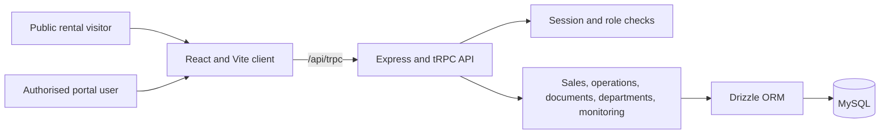
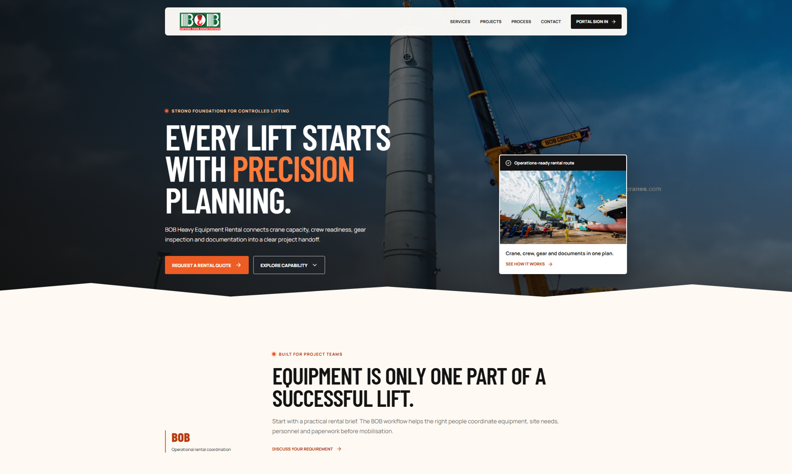
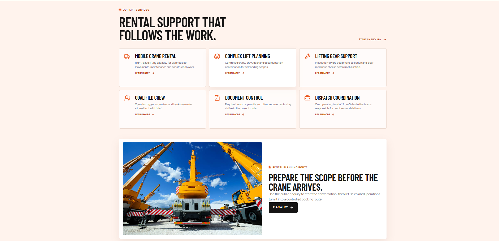
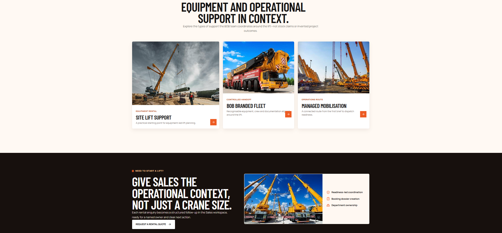
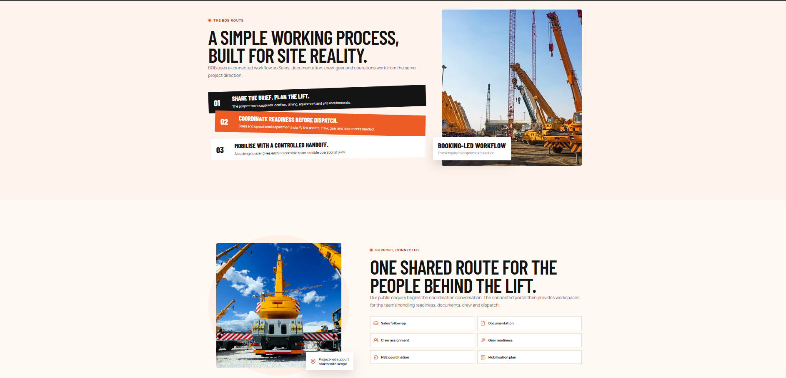
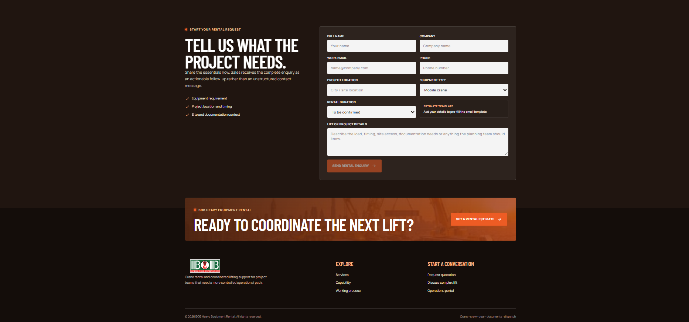
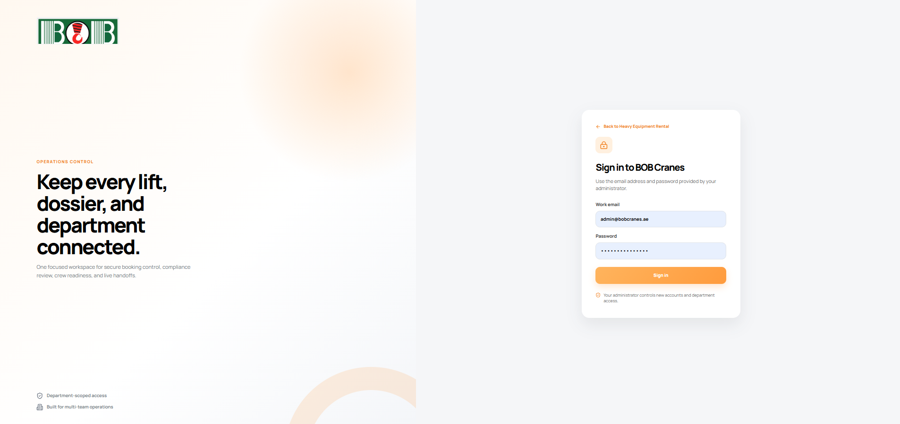
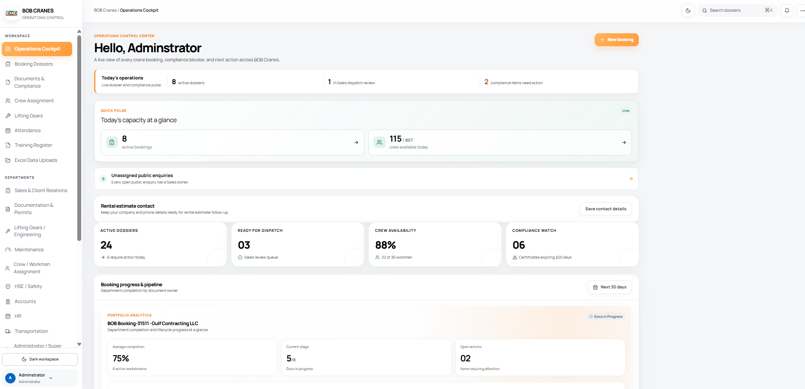

# BOB Cranes Operations Portal

> A role-aware operations platform for crane-rental enquiries, booking control, crew and lifting-gear readiness, document coordination, dispatch preparation, and internal departmental workflows.

[](https://github.com/docs-bit/bob-cranes-operations-portal/actions/workflows/quality.yml)

**Live portal:** [bob-cranes-portal.vercel.app](https://bob-cranes-portal.vercel.app)

**Production branch:** [`main`](https://github.com/docs-bit/bob-cranes-operations-portal/tree/main)
**Primary stack:** React 19, TypeScript, Vite, Express, tRPC, Drizzle ORM, and MySQL.

## Overview

The public site captures structured rental requirements. The internal portal gives authorised teams a shared workspace for progressing enquiries, coordinating bookings, assigning crew and equipment, managing supporting documents, and preparing controlled mobilisation.

| Area | Current capability |
|---|---|
| Public rental journey | Service information, project capability context, validated rental enquiries, and a direct route to portal sign-in. |
| Sales and booking control | Enquiry triage, assignment, response controls, booking dossiers, staged workflow progression, and notifications. |
| Operational readiness | Fleet, trailers, lifting gear, crew allocation, availability checks, attendance, training, documents, and dispatch readiness. |
| Department workspaces | Role-aware views for Sales, Documentation, HSE, Crew, Accounts, HR, Transportation, and Lifting Gears. |
| Governance and visibility | Audit/activity records, saved filters, client feedback, browser runtime-error capture, and web-vitals telemetry. |

## System architecture

The browser application uses typed tRPC requests under `/api/trpc`. Express applies authentication and authorization before the domain routers access MySQL through Drizzle ORM.



| Layer | Source of truth |
|---|---|
| Client routes and page composition | [`client/src/App.tsx`](client/src/App.tsx) |
| API router composition | [`server/routers.ts`](server/routers.ts) |
| Express application and tRPC mount | [`server/_core/app.ts`](server/_core/app.ts) |
| Authentication implementation | [`server/localAuth.ts`](server/localAuth.ts) |
| Database schema and migration configuration | [`drizzle/schema.ts`](drizzle/schema.ts) and [`drizzle.config.ts`](drizzle.config.ts) |
| Vercel routing and headers | [`vercel.json`](vercel.json) |

## Product walkthrough

### Public rental experience

The public landing page provides a controlled-lifting proposition, service context, a rental-quote action, and the route to portal sign-in.



*Public landing page with the rental-quote and capability entry points.*



*Service catalogue and lift-planning context.*



*Equipment and operational support presented in project context.*

### Delivery workflow and portal workspace



*The public workflow: capture the brief, coordinate readiness, and mobilise.*



*The rental-enquiry form captures the project information needed for Sales follow-up.*



*Authorised users sign in through the local-auth flow. A new database exposes the first-administrator setup flow.*



*The Operations Cockpit consolidates priority actions, capacity, compliance, and department navigation.*

## Application routes

| Route | Audience | Purpose |
|---|---|---|
| `/` | Public | Rental landing page, service context, and quote enquiry. |
| `/login` | Public | Local sign-in and first-administrator setup when no local users exist. |
| `/portal` | Authorised users | Role-aware Operations Cockpit. |
| `/uploads` | Authorised Accounts users | Data upload workspace. |
| `/attendance` | Authorised HR users | Attendance workspace. |
| `/training` | Authorised users | Training register. |
| `/crew` | Authorised Crew users | Crew-assignment workspace. |
| `/gear` | Authorised Lifting Gears users | Gear workspace. |
| `/client/:token` | Client collaborators | Booking-document collaboration flow. |
| `/api/trpc/*` | Client application | Typed API surface. |

## Getting started

### Requirements

Use the package manager pinned by the repository: **pnpm 10**. Local development requires a reachable MySQL-compatible database and a recent Node.js runtime; the supported persistent container and CI workflow use Node.js 22.

```bash
corepack enable
pnpm install --frozen-lockfile
cp .env.example .env
```

Set `DATABASE_URL` and a strong `JWT_SECRET` in `.env`. The complete variable reference is in [`.env.example`](.env.example); do not commit local environment files or credentials.

### Local development

```bash
# Generate and apply migrations only against a local or disposable database.
pnpm run db:push

# Start the Express and Vite development server.
pnpm run dev
```

Open [http://localhost:3000/portal](http://localhost:3000/portal) to create the first administrator for an empty local database. The optional demonstration dataset is intended only for local or disposable environments:

```bash
SAMPLE_DB_PASSWORD='local-only-password' pnpm run db:seed:sample
```

> Never use `db:seed:sample` against a shared, staging, or production database.

## Quality gates

| Command | Purpose |
|---|---|
| `pnpm run check` | TypeScript compilation without emitted files. |
| `pnpm test` | Vitest unit and integration suite. |
| `pnpm run test:e2e` | Playwright smoke tests for the public rental flow and portal entry state. |
| `pnpm run build` | Vite production client build and Node server bundle. |
| `pnpm run lighthouse:ci` | Local Lighthouse CI helper. |

The [`Quality gates`](.github/workflows/quality.yml) workflow runs on pull requests to `main`, pushes to `main`, and manual dispatch. It validates types, tests, a production build, and Chromium browser smoke tests. Dependabot proposes weekly npm dependency updates through [`.github/dependabot.yml`](.github/dependabot.yml).

Before running browser tests on a new machine, install Chromium once:

```bash
pnpm exec playwright install chromium
pnpm run test:e2e
```

## Deployment and operations

**Active production topology:** GitHub `main` → Vercel → Railway MySQL. Vercel builds the Vite client, serves `dist/public`, and routes `/api/*` to the serverless Express/tRPC handler in [`api/index.js`](api/index.js). The routing and browser-security headers are defined in [`vercel.json`](vercel.json).

| Production control | Policy |
|---|---|
| Application release | Push or merge a reviewed change to `main`; Vercel deploys the linked branch. |
| Database migration | Review committed migrations, back up the target database, then run `pnpm exec drizzle-kit migrate` from a trusted environment. |
| Database seeding | Never seed a production database with `db:seed:sample`. |
| Production check | Confirm `/`, `/portal`, and the read-only `auth.setupStatus` tRPC endpoint after release. |
| Railway | The repository retains Docker and Railway configuration for a persistent deployment alternative. It is not an active GitHub deployment source and does not run migrations at container startup. |

The detailed procedures for releases, migrations, verification, monitoring, rollback, and credential hygiene are in [the production-readiness runbook](docs/PRODUCTION_READINESS.md).

## Security

Local credentials are hashed with `scrypt`. Successful local sign-in creates a signed, 12-hour session, and server-side procedures enforce account role and department permissions. Public sign-in, first-administrator setup, rental enquiry, feedback, and anonymous telemetry endpoints use client-aware in-memory rate limits.

Keep `DATABASE_URL`, `JWT_SECRET`, and third-party credentials only in protected environment settings. Report suspected vulnerabilities privately as described in [SECURITY.md](SECURITY.md); do not open a public issue containing a security-sensitive reproduction or secret.

## Documentation

| Document | Use it for |
|---|---|
| [Architecture guide](docs/ARCHITECTURE.md) | Components, API domains, data model, authentication, and route boundaries. |
| [Development guide](docs/DEVELOPMENT.md) | Environment setup, database lifecycle, local workflows, and testing. |
| [Operations guide](docs/OPERATIONS.md) | Vercel deployment, production migration, verification, rollback, and monitoring. |
| [Production-readiness runbook](docs/PRODUCTION_READINESS.md) | Release checklist and ongoing operational safeguards. |
| [Historical records](docs/HISTORY.md) | Index of retained QA, design-reference, and verification records. |
| [Security policy](SECURITY.md) | Responsible reporting and supported release line. |
| [Contribution guide](CONTRIBUTING.md) | Change scope, validation, migration review, and pull-request expectations. |

## Repository map

```text
api/                         Bundled Vercel serverless API entry
client/                      React and Vite application
  public/assets/             Published images used by the landing page and README
  src/components/            Reusable UI and operational feature components
  src/pages/                 Public landing, authentication, portal, and workspace pages
server/                      Express API, tRPC routers, authentication, persistence, and tests
  _core/                     Server factory, context, integrations, and Vite/static runtime
  routers/                   Domain tRPC routers
drizzle/                     MySQL schema and generated migrations
docs/                        Architecture, development, operations, and historical documentation
e2e/                         Playwright smoke tests
scripts/                     Sample-data and Lighthouse helpers
```

## Contributing

Keep changes focused, update the relevant documentation with any behavior or configuration change, and run the applicable quality gates before opening a pull request. Do not commit secrets, database dumps, generated build output, or local environment files.

For operational changes, include a migration review where applicable and verify both the public rental path and the authorised portal after deployment.

---

This README is an entry point. The implementation files and linked guides above are the source of truth for maintained behavior and operational procedure.
