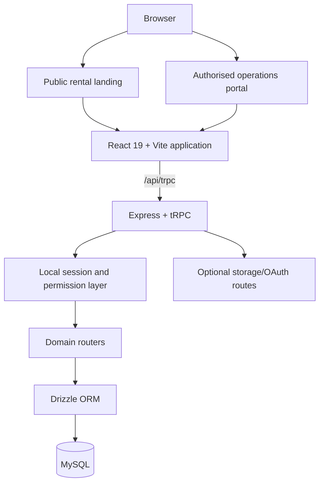

# Architecture guide

## Purpose and scope

BOB Cranes Operations Portal is a single-repository web application that joins a public crane-rental journey to a role-aware internal operations workspace. The system does not attempt to replace accounting, payroll, or fleet telematics platforms. Its purpose is to coordinate the operational handoff from a rental requirement through booking readiness, controlled mobilisation, and supporting departmental work.

## Runtime components

| Boundary | Implementation | Responsibility |
|---|---|---|
| Client | `client/` | Public landing page, sign-in, portal workspaces, client collaboration UI, route-level lazy loading, and browser telemetry. |
| HTTP application | `server/_core/app.ts` | Express middleware, JSON parsing, storage/OAuth routes, and the `/api/trpc` mount. |
| API contract | `server/routers.ts` and `server/routers/` | Typed public and protected procedures for operational domains. |
| Access control | `server/_core/trpc.ts`, `server/localAuth.ts`, and router middleware | Local-session validation, role checks, department ownership checks, and procedure-level authorization. |
| Persistence | `server/db.ts` and `drizzle/` | Database helpers, MySQL entities, relations, migrations, and seed support. |
| Serverless production entry | `api/index.js` | Bundled Express/tRPC handler used by Vercel. |

## Client routes

The client route map is maintained in [`client/src/App.tsx`](../client/src/App.tsx). The public rental experience is available at `/`; the internal workspace entry is `/portal`; and supporting routes include `/login`, `/uploads`, `/attendance`, `/training`, `/crew`, `/gear`, and `/client/:token`.

The public landing page is intentionally separate from the internal workspace. This preserves a concise rental-quote journey while allowing the portal to enforce authenticated departmental access.

## API domains

The root router composes several domain routers. The procedure names and input types are authoritative in the corresponding source files; the following table describes their maintained business boundary.

| Domain | Primary responsibility |
|---|---|
| `auth` | First-administrator setup, local sign-in/out, session lookup, user management, permission visibility, and account activity controls. |
| `rental` and `salesEnquiries` | Public quote capture and the Sales lifecycle for enquiry assignment, response, status, and conversion. |
| `operations` | Bookings, workflow stages, workstreams, equipment, crew allocations, documents, messages, notifications, and dispatch readiness. |
| `departments` | Department dashboards, lifecycle configuration, templates, and department-specific operating context. |
| `documents` | Document taxonomy and persisted client-document metadata. |
| `runtimeMonitoring` and `telemetry` | Browser runtime-event and web-vitals collection. |
| `filterPresets` and `clientFeedback` | Persisted operational views and client feedback records. |

## Authentication and authorization

The local-auth flow hashes credentials with `scrypt` and signs a short-lived session token after successful verification. The authentication layer places the session-safe user record in tRPC context; protected procedures use that context rather than relying on client-side navigation alone.

| Account type | Intended access boundary |
|---|---|
| Administrator | Full operational, account-management, configuration, dashboard, and governance access. |
| Supervisor | Department-scoped people management and permitted operational administration. |
| User | Workspace access constrained by department and procedure-level rules. |

The first local administrator can be created only when the user table is empty. Once an administrator exists, subsequent account operations require the appropriate protected procedure. Public mutations are rate-limited in the API as a first-line control; provider-level protection remains necessary for distributed abuse prevention.

## Data model and database lifecycle

The schema is defined in [`drizzle/schema.ts`](../drizzle/schema.ts), and generated migrations live under [`drizzle/`](../drizzle/). The database covers users and departments alongside equipment, trailers, lifting gear, crew, bookings, allocations, documents, enquiry records, notifications, dashboards, activity records, telemetry, audit data, and related workflow entities.

> The TypeScript schema, committed migration history, and target database must stay aligned. Generate new migrations in development, review the generated SQL, then apply only reviewed committed migrations to production.

For detailed local setup and migration commands, use the [development guide](DEVELOPMENT.md). For production change control, use the [operations guide](OPERATIONS.md).

## Deployment model

The active release path is GitHub `main` to Vercel. Vercel serves the Vite output and sends `/api/*` to the bundled serverless handler. Vercel configuration also applies browser-security headers and prevents API caching.

A Dockerfile and Railway configuration remain available for a persistent Node deployment alternative. Railway is not an active GitHub deployment source for this repository, and the retained container start command does not apply migrations automatically.

## Design constraints

The architecture follows these operational constraints:

1. **Public and internal workflows remain distinct.** Public enquiry inputs are minimal and validated; operational data remains behind authenticated procedures.
2. **Permissions are enforced on the server.** Client-side route guards improve usability but never replace procedure-level checks.
3. **Database changes are deliberate.** Deployment does not generate or apply new production migrations automatically.
4. **Release verification is repeatable.** Type checking, automated tests, production builds, and browser smoke tests form the baseline quality gate.
5. **Secrets stay outside Git.** Connection strings, signing keys, and provider credentials belong in protected environment settings only.

## Key implementation references

| Topic | File or directory |
|---|---|
| Client route composition | [`client/src/App.tsx`](../client/src/App.tsx) |
| Public landing page | [`client/src/pages/RentalLanding.tsx`](../client/src/pages/RentalLanding.tsx) |
| Shared Express application | [`server/_core/app.ts`](../server/_core/app.ts) |
| Router composition | [`server/routers.ts`](../server/routers.ts) |
| Local authentication | [`server/localAuth.ts`](../server/localAuth.ts) |
| Request context and procedures | [`server/_core/context.ts`](../server/_core/context.ts), [`server/_core/trpc.ts`](../server/_core/trpc.ts) |
| Database schema | [`drizzle/schema.ts`](../drizzle/schema.ts) |
| Vercel entry and routing | [`api/index.js`](../api/index.js), [`vercel.json`](../vercel.json) |
| Quality workflow | [`.github/workflows/quality.yml`](../.github/workflows/quality.yml) |
