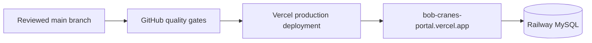

# Operations guide

## Active production topology

The active release path is:



Vercel is the production application host. It builds the Vite client, serves `dist/public`, and rewrites `/api/*` requests to the bundled Express/tRPC handler in [`api/index.js`](../api/index.js). The current routing, cache policy, and browser-security headers are maintained in [`vercel.json`](../vercel.json).

The repository retains [`Dockerfile`](../Dockerfile) and [`railway.toml`](../railway.toml) for a persistent deployment alternative. Those retained Railway application services are not linked to GitHub auto-deploys and are not an active release-status source. The container starts the application only; it does not apply database migrations automatically.

## Required Vercel configuration

| Setting | Expected value or action |
|---|---|
| Install command | `pnpm install --frozen-lockfile` |
| Build command | `pnpm exec vite build` |
| Output directory | `dist/public` |
| Serverless API | `api/index.js` handles `/api/*` requests. |
| Required production variables | Set `DATABASE_URL` and `JWT_SECRET` as protected values. |
| Optional analytics | Set `VITE_ANALYTICS_ENDPOINT` and `VITE_ANALYTICS_WEBSITE_ID` together, or leave both unset. |
| Deployment branch | `main` is the linked production branch. |

Do not add real credentials to Git, build output, screenshots, issue descriptions, or deployment logs.

## Release checklist

Before merging or pushing a production change, confirm the following items.

| Gate | Evidence |
|---|---|
| Code quality | `pnpm run check`, `pnpm test`, and `pnpm run build` succeed. |
| Browser flow | `pnpm run test:e2e` succeeds when the change affects routes, public rental capture, sign-in, or portal navigation. |
| Migration review | A database change includes reviewed SQL artifacts and a planned apply-only command. |
| Environment review | Required production variables exist and no secret is included in the change. |
| Documentation | README and the relevant guide reflect any changed route, command, configuration, or operating procedure. |
| Live verification | Public landing, `/portal`, and the API health query respond after release. |

GitHub Actions runs the same baseline validation on pull requests to `main`, pushes to `main`, and manual dispatch. The workflow is defined in [`.github/workflows/quality.yml`](../.github/workflows/quality.yml).

## Production database changes

Database migration is a separate, deliberate operational step. Vercel deployment does not generate or apply schema changes.

1. Review the schema change and generated migration artifacts in a development environment.
2. Back up the intended production database and confirm `DATABASE_URL` points to that environment.
3. Run the apply-only command from a trusted environment:

   ```bash
   pnpm exec drizzle-kit migrate
   ```

4. Deploy the compatible application version.
5. Verify the public route, portal entry, and a read-only API query.

> Do not run `pnpm run db:push` or `pnpm run db:seed:sample` against production. The former generates migrations as well as applying them; the latter creates demonstration records.

## Production verification

Use non-destructive checks after a deployment. The following commands should return HTTP 200 when production is healthy:

```bash
curl --fail --silent --show-error https://bob-cranes-portal.vercel.app/

curl --fail --silent --show-error \
  'https://bob-cranes-portal.vercel.app/api/trpc/auth.setupStatus?input=%7B%22json%22%3Anull%7D'
```

Then perform a visual check of the public landing page, open `/portal`, and confirm that the sign-in or first-administrator state is appropriate for the target database. Do not submit test enquiries or create test accounts in production unless the business owner has approved that activity.

## Security and monitoring controls

| Control | Current policy |
|---|---|
| Browser hardening | Vercel sends nosniff, frame-denial, referrer, permissions, and cross-origin-opener headers. |
| API caching | `/api/*` is marked `no-store`. |
| Authentication | Local credentials are hashed with `scrypt`; session tokens are signed and validated server-side. |
| Public abuse controls | Public auth setup/sign-in, enquiries, feedback, and anonymous telemetry apply client-aware in-memory rate limits. |
| Application visibility | Runtime errors and browser web-vitals can be collected through the monitoring procedures. |
| Dependency maintenance | Dependabot is configured for weekly npm updates. |

The API rate limit is an application-level safeguard. Maintain provider-level firewall, bot management, alerting, database-network controls, and least-privilege database access as complementary production controls.

## Rollback and incident response

If a release causes a regression, use the smallest safe recovery action.

1. Establish whether the incident is client-only, API-only, database-related, or a third-party dependency/integration issue.
2. Preserve relevant timestamps, request IDs, deployment IDs, and non-secret error details.
3. For an application-only regression, redeploy the last known-good Vercel deployment or revert the responsible Git commit through the normal review path.
4. Do not roll back a database schema blindly. Assess migration reversibility, data compatibility, and backup availability first.
5. Verify the public landing, portal entry, and read-only API query after recovery.
6. Document the cause, corrective change, and verification in the appropriate issue or retained operational record.

For suspected vulnerabilities, use the private reporting path described in [`SECURITY.md`](../SECURITY.md) rather than a public issue.

## Ongoing ownership

| Operational area | Maintain it by |
|---|---|
| Application dependencies | Review Dependabot pull requests and rerun the required quality gates. |
| Credentials | Keep hosting variables protected; rotate secrets if exposure is suspected. |
| Database | Review migrations and backups before every production change. |
| Documentation | Update this guide and the README whenever topology, release gates, variables, or verification steps change. |
| Deployment status | Treat the green Vercel Production deployment and the GitHub quality workflow as the active release evidence. |
